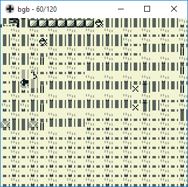
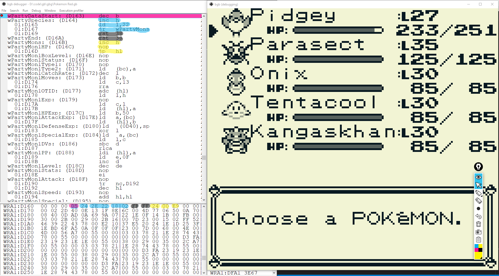

# The Old Man Glitch - Presentation of a classic Pokémon First Generation bug.

  This document should contain everything you need to replay or give the the presentation I gave at Jug User Group Toulouse and DevFest 2018 Toulouse.
  If it does not, feel free to contact me via twitter : @ftregan

  You will need about 45 minutes to give this presentation, provided you don't do any error which may require a bit of preparation. There are fourteen intermediate game state save files in case something during goes wrong during the presentation. They have the same name as the corresponding chapters in this documentation. 

## Setting up everything

  This chapter guide you thgough setting everything to reproduce the demonstration.
  If you just want the writeup, skip to next chapter.

### Resolution

  My screen setup is FullHD (1920 x 1080) with auto-hidden taskbar.
  This is usefull for the presentation (compatible with most videoprojectors and choosen font size)
  Having a black empty desktop bacground is nice (at least the bottom of the right half should be clean)

### BGB - GameBoy Emulator

  I used BGB emulator, which can be downloaded at http://bgb.bircd.org/. It's ment for Windows but runs under Wime.

  In the presentation directory, you will find a `bgb.ini`, which have the following changes when compared to default one :
* Font size is increased in order to allow audiance to read
* Color for breakpoints, highlight, and current line are change to look better and for important accessibility reasons
* Key are set for AZERTY keyboard, using A and Z for buttons, 1 and 2 for start and select

### EpicPen

  [EpicPen](https://epic-pen.com/) is a tool to highlight things on screen with different colors. It is usefull only if you plan to give the talk.
  Run it, roll it, and move it to some place on the right side.

### The ROM

  All addresses are given for the Pokémon Red English version ROM.

### Disassembled and commented source code

  Though not used udring the presentation, you may want to download the code from https://github.com/pret/pokered

### Documentation

* The `gb-programming-manual.pdf` document is an unofficial GB Developper doc.  Chapter 4 - `CPU Instruction Set` - lists all instructions and opcodes.
* The [Big HEX list](https://glitchcity.info/wiki/The_Big_HEX_List) gives correspondance between Hex value, Pokémon type, Items, Characters and more
* [Glitch City Laboratories Forums' thread about 8F item](https://forums.glitchcity.info/index.php?topic=6638.0)

### Sylink file

  There is a `Pokemon Red.sym` file in this repository, it must be in the same directory as the ROM file which must be named `Pokemon Red.gb`. This enables the debugger to display human readable labels. (Either copy the `.sym` file to where the ROM file is or copy the ROM in this directory.)

### Run BGB and Pokémon Red

* Start GBG, load the initial state provided in the `00 - Title.sna` file (`ctrl-l`).
* Bgb should either load the `Pokemon Red.gb` ROM file or ask you where it is (else try loading it usingby pressing `F12` key).

### Initial configuration of the screen

* Stretch the screen window of GBG so it takes the full height of the screen and have a 1:1 aspect ratio
* Move this windows to the right side of the screen
* Open the debugger (`esc` key)
* Move it to the left side
* Stretch it so it takes full height and the memory view (bottom of the windows) show the hex value but not the text values

### Initial state of the emulator

* Add breakpoints at the following addresses :
  * `1:D163`
  * `4:789E`
  * `4:78DB`
* Disable the last two breakpoints (they are just used to highlight the lines)
* In the memory (hex) view, go to `WRA1:D887` (use `ctrl-g`) and scroll so it is on fisrt line
* In the code view, go to `4:7888` and scroll so it is on firt line
* Run the game (`F9` key)

### Optional : Modify the menu to display speaker's name

  You can not directly modify the VRAM (video memory) to change the displayed menu because it is recopyed from a buffer in memory at each VBLANK (that is about 60 times per second). You should edit the buffer instead. The buffer will be re-built when you exit the menu, so no trave of the modification will stay in memory and you can start playing directly.
  Here are the addresses at which you whant to modify the buffer:

Addr | Data (hex)     | Tiles   
-----|----------------|---------
c3d4 | 93a7a47f7f7f7f | The     
c3e8 | 8eaba37f7f7f7f | Old     
c3fc | 8ca0ad7f7f7f7f | Man     
c410 | 86aba8b3a2a77F | Glitch  
c424 | 7f7f7f7f7f7f7f |         
c438 | 85a0a1a8a4ad7f | Fabien  
c44c | 93918486808d7f | TREGAN  
c460 | 7f7f7f7f7f7f7f |         
c474 | 93b6a8b3b3b19c | Twittr: 
c488 | a5b3b1a4a6a0ad | ftregan 
c49c | 7f7f7f7f7f7f7f |         

  The data (hex values) can be generated using the [`string to pokemon hex codes.html`](string to pokemon hex codes.html) file.

  Re run (`F9`) after modification.

### Final setup

Your screen should now look like this (except the `Breakpoints` windows which should be closed) :

## Introduction

> First lets start with a few question :
> * Who here does love Assembly Language ?
> * Who here writes Assembly ?
> * Who here likes bugs ?
> * Who here loves bugs ?

## 00 - Title

### Showing the bug

> My name is Fabien. Today we are going to speak about a bug. This bugs is known as The Old Glitch, it resides in first generation of Pokémon on Gameboy.

Quit the menu 

> Pokémon is an RPG game which came out in 1994, 1996 in Europe. You can move around in the world.

move around while saying this, stop next to the East shore facing east and re-open the menu.

> Here my character is named GGGGGGG (we'll see later why), he carries 5 items then an `X SPECIAL` and a `DOME FOSSIL` (we'll see why also).

Show while saying

> Here I am safe because I am in a town, but outside of towns if I walk in Long Grass, in Caves or if I surf in Water I can be attacked by Wild Pokémons. I can fight them and try to capture them. Once I've captured them I can use them to fight other Wild Pokémons or again NPC's Pokémon to progress in the game. The Pokémons can level up, and when they have leveled up enough they can learn new attacks. Once I've made enough progress in the game, I can use some of these attack to do other things than fighting. Here as an example I can use my GYARADOS' SURF attack to go in water.

do it, move at least one tile east so you are no longer on the shore.

> Once I'm in water I can be attacked by Wild Pokémons.

Move south-north until you are attacker, hopefully by a level 30 TENTACOOL

> Here I'm rather late in the game so I should be attacked by level 20-30 Pokémons.

Escape the fight, go on the shore and move north-south

> The bug I want to show you occurs here.

Wait for an attack, which hopefully will be a Level 3 RATTATA, press a key to open combat menu

> Did someone see the bug ? I am in water, but I've been attacked by a RATTATA which abviously is a ground Pokémon and should not be found in Water. Moreover, it is Level 3 and this place is rather late in the game ; I should encounter level 20-30 Pokémons, not level 3.
>
> Astonishing, isn't it ? This quiet unimpressiv bug is the starting point of a glitch which is the most famous of the Pokémon game, probably of the GameBoy, and maybe one of the top 10 most famous bugs in videogame history.

### The off-by-one error

> Now to understand why this bug is so famous, let's have a look at what happens inside the code. There are to arrays that help determinate which Wild Pokémon you will encounter : One is here at address `D887`, starting with this `00`, the other one is a little further, starting with this `05`.

Note : you can use EpicPen to highlight the tables.

> The first one is default case, the second one is for Water Pokémons. The first number is the probability of encountering a Wild Pokémon (`00` meaning no encounter because we are safe when in town, and `05` meaning 5 chances out of `256` when on Water). Then we have a list of Pokémons that can be encountered going like this : Level of the most probable encounter, followed by type of the Pokémon of the most probable encounter, Level of a bit less probable encounter, and its type, again and again until the ninth one (with 1.2% encounter probability).
>
> Looking at the code, we see at address `789E` that we load the address `C45D` into `ld` register,

Note : It should be highlited in pale pink.

> then load into register `c` what is at this address, load `wGrassTile` into `a` and compare `a` and `c`. `C45D` is the address of this tile on the bottom right quarter of my character, so here it is Water. If it is Water we'll read the probability of encountering a Wild Pokémon in the second table - the Water one - else we use the first one.
>
> We can then generate a random number, compare it with the given probability to determine if we encountered a Wile Pokémon. If we encounter one, we need to determine which one and for this, line `78DB`, we read again the type of tile we stand on at address `C45C`.

Note : you need to scroll down a few lines. It should be highlited in pale pink.

> And maybe you saw the problem? We read `C45D` - bottom right quarter of my position - to say 'Were are on Water, we have 5 chances out of 256 to encounter a Wild Pokémon', and now we look at `C45C`, which is bottom *left* corner, to determine which is encountered pokemon. We have what we call an off-by-one error.
>
> Since bottom *left* corner of my character does not stand on water, we will use the default table of pokemon to determine the type and level of the encounter, when we used the water table to get the probability of encounter. Hence we encounter a non-Water Pokémon while surfing on a Water Tile.

### Reuse After Free

> Something interesting since we have an off-by-one error, is to study how the data from the table that should not be read are generated.

go left past the `GYM` house, then up to this position :

Be carefull not to walk on the pond yet, stay in town.

Both tables of encounters should be highlighted on screen. If not, do it now.

> Here we are in a Town, which is a safe zone with zero probability of encountering a Wild Pokemon except in Water. If we walk forward one step North, we will change of Zone and some code will be executed that generate the new table of possible encounter. See what will change.

Move one step north

> Everything changed: The probability in `D887` went from `00` to `19`, and the whole list of possible Pokémon Types and their level changed. Now if I go back in town, see what happens

Move one step south.

> We executed the code that fills the table for the towns. The towns are safe, there are no possible encounter, so it sets both encounter probabilities to `00`. Then since there is no probability of encounter, there is no need to fill the remaining of the encounter table. So anything that was here stays here, it is just garbage.
>
> The Zone on the east contains only water, so for the same reason when enter it, the probability of encountering a non-Water Pokémon is set to `00` and the garbage stay there. But because we have this off by one error, we are going to use the garbage anyway. This is called a Reuse After Free.
>
> So we hade an off-by-one error, which makes us read the wrong table, and since this table is not reinitialised we now have a Reuse After Free.

## 01 - The Old Man fighting

### What to do when you find a Reuse After Free

> So we now have found a RAF. When we have this kind of bad pattern, it would be fun to find something in the game that any writes any values here, which will later be used as if they were legit Pokémon descriptions.
>
> There is one place in the code that write to `D887`: it is when you link two GameBoys to play Player versus Player. It writes the name of the other player here. But that's not interesting to us because once you entered the PvP mode, you can not go back to normal game. You need to reset the GameBoy, which resets all memory.
>
> But there is another piece of code which uses the buffer that stores the PvP opponent's name.

### Encounter Old Man

> This happens early in the game, in the second town you enter. Lets fly here.

Use the Fly move on Dux to fly to VIRIDIAN CITY.

> The is an NPC here, called "Old Man" - hence the name of the glitch : The Old Man Glitch - who will show you how to capture Wild Pokémons.

Go a few tiles left, then about to screen north until you meet the Old Man.

Speak to him, answer `No` to his question.

> If you tell him you are not in a hurry, he will show you how to capture them. The game then start a normal battle, with three main differences

Press button until the Old Man and Wild Pokemon appear on screen

> First the picture here is not mine it is the one of the Old Man. Second, the fight is scripted, I can not play. Third, look at this:

Start the fight, and pause (press `esc`) just after the Old Man has choosed the pokemon, while he is throwing it.

> Instead of writing `GGGGGGG used POKé BALL!` it says `OLD MAN used Poké BALL!`. To do this and still use the existing code for fights, it copies the name `Old Man` to where my character name was. But of course later it will need my real name, so it saves it. And where does it save it? In the buffer where it write the name of the opponent in PvP mode. So if you now look at the `D887` address, you will see `86 86 86 86 86 86 86`,  which is my name (`GGGGGGG`), followed by a `50`, which is the String terminator in Pokémon - String are not terminated with a `00` but with a `50` in Pokémon.
>
> Now I can leave the fight, I will be back in Town so the probability of encountering a non-Water Pokémon will be set to `00` but the `86 86 86 86 86 86 50 00 00` remains.

show it.

## 02 Fighting MissingNo.

> I can now leave town, hence enter a new zone and the `86`s will be overwritten by correct data. But if I Fly to another town...

Fly back to CINNABAR ISLAND

> The probability is reset to `00` but following garbage remains. Earlier the garbage was made of the list of Pokémons for the last Zone I visited. But now it's made of my name,  which is something I can somehow control. There are heighty-height characters I can choose out of 256 possible values. So if you could choose the pokemon you would encounter, which one will you choose ?

The audience will probably answer with a legendary Pokémon, maybe Mew or Mewtwo

> Mew is not possible, it's code is not in the 70 possible characters for the name. Mewtwo is Possible though, its code is `83` so if my name is set to `DDDDDDD` I can fight it. I can only choose level between 127 and 191, he will heal fulllife constantly, but I can fight it. But it's not what one I choose. There is something more interesting pokemon to fight than a legendary one, lets see what we choosed.

Use surf to go on the shore and encounter a `'M` or a `MissingNo.`. If you encouter something else, explain the audiance that you have just been unlucky and got one of the last pokemon of the table, and try again. If you encounter a MissingNo., tell them that's this is Pokémon number `86` with level `86` (which is hexadecimal code for 134). If it is M', tell them it is Pokémon number `00` with level either `50` or `00`

> So here is our Pokémon. What happens? The value is not a correct one, so when the code uses it to calculate the address of the name of the Pokémon or the address of the data for the picture, it reaches some weird data.
>
> This starts to be fun: We hade an off-by-one, causing a Reuse After Free, and now we know how to inject weird data to fight a glitched pokemon. But there is more to come ;)

Try to run away, or let your Pokémon die,  and go in town.

## 03 129 X SPECIALs

> In Pokémon we have the Pokédex, which is a list of all the Pokémons types I have encountered or captured.
 
  Show it

> If we look for our 'M / MissingNo. in the Pokédex...

  Scroll down the whole list

> We can't find it. This it because in memory, it is not a variable length list where things can be added, it is a fixed sized memory area. We calculate the address of the byte coresponding to a given Pokémon Type number, and toggle a bit to indicate that we encountered it. And when we do this calculation with an invalid number (`00` or `86`) we reach some random place in memory which is outside of the Pokédex area.
>
> In fact it is not random, it is fixed. And where is it? It is just after the Pokédex area in memory, it is...

go back up in menu, show item list

> It is in the list of item we carry. More precisely, in the quantity of the sixth item. So how many do we have now ?

Scroll down:

> This character here is the third tile after the `9` tile, so it is a (9 + 3 =) 12, and this is a 9. 12 * 10 + 9 = 129. We hade one X SPECIAL (`b00000001` in binary). The heighth bit has been toggled, we now have `b10000001`, which is 129.
>
> So we hade an off-by-one error, leading to a Reuse After Free. We could craft our name to inject invalid values in the reused value, and nowwe have a buffer overflow, allowing us to multiply our sixth item ! At least something usefull :) But there is more.
>
> You see that the game does not know how to display 129 quantity. This is because in Pokémon you are limited to stacking 99 items. Lets play with that.

## 255 X SPECIALs

> I can toss items. So lets toss two X SPECIALs.

do it 

> We now have 127 X SPECIALs, which is `b01111111`. So we can encounter the glitched Pokémon again, switch the heighth bit again, and have `b11111111`, which is 255.

show it

## 0 items but 255 XSpecial anyway

> Lets have a look at how the items are represented in memory

Delete all the highlighting made with EpicPen. In the memory view of the debugger, go to address `WRA1:D31E`

> We have this `C9` here that is the value for item TM01, then a `01` which is its quantity. Then a `CA` for TM02, `CB`, ... `CD`, then `44` which is the code for X SPECIALs and we now have `FF` stacks of it, then `01` DOM FOSSIL (`29`) and an `FF` which is a list terminator.
>
> Also there is something else. But please be kind, don't do this in your production code...
>
> If we look before `D31E` at `D31D` there is this `07`. It is the number of item I have in my Items List. So we both have a terminator to tell where the end of the list is, and a length to tell us what the length of the list if. We all know something wrong happen.
>
> As an example, if I toss the HM01, it will decreased the amount of item, and copy each item in memory two bytes backwards, until it copies the `FF` terminator. Or the glitched `FF` item number.
>
> So if we continue to toss all the HM0x, we decrease the counter to `02`, but instead of copying the `FF` terminator in place of the last X SPECIAL item, it stops. So the previous X SPECIAL stack stays here *and* is copied. So I now have plenty of stacks of X SPECIAL.

> But there is a problem: since the item counter has been decreased to `02`, it displays lot of X SPECIALS stacks, but I can only use the two first ones. The third one is treated as the `CANCEL` menu and I can't go further.
>
> So we can just toss them all.

Toss all that you can. Use `Up` key to select max quantity, repeat until the menu is wuit when you try to toss the first item.

> Now we have zero items, even if it displays lot of item.
>
> We hade an off-by-one error, we could Reuse After Free a buffer with some data we could control, and now we have desynchronized the size and content of the item list.
>
> Let's go just one step further :)

## 255 Items

> If you remember it, after the X SPECIAL I began with an item called DOME FOSSIL. This is a quest item: an item I can give to an NPC to advance in the game. I will show you.

Go to south shore, then left, go up to enter the last house, then right to the last door in the corridor, and up to meet the Doctor. Speak to him.

> This doctor can resurect Pokémons from fossils. When I speak to him, the game will iterate through items in my list until it finds either the DOME FOSSIL (code `29`) or the end of the list (using the `FF` terminator, ignororing the `00` length).

Do it.

> It finds it, removes it from the inventory and decreases the item count. It was `00` and `00` minus ones is ? Not -1, it is `FF`. Just like two hours before 1am is not -1am it is 11pm. This is called an Underflow.
>
> the value of the item counter is now `FF`, i.e. 255. Which of course is way more than the real size of the items table. So now if we try to display the item list and scroll down past the `Cancel` menu, it will show things generated from random data. This is called a Buffer Overflow.

Show the Item menu, and scroll down.

> It may hang the game. This is because we can find values that are invalid item numbers and some of them can, when we calculate the address of the string, lead to badly handled data. The content of the item list is now dependant on other things in the game. Let's fly to a particular place.

## 35th item is a nugget in celadon

Fly to CELADON CITY (center of map) and walk East a few step to reach this position:

> When I am in this place, all the data in memory are ok and none make the game hang when I display the item list. Lets have a look at the 35th item.

Go down 34 times in item list, untill you reach GOLD NUGGET 1X. Leave the menu and come back to clean display.

> Here we have this item, a GOLD NUGGET. If I move left one step, see what happens.

Leave menu, walk one step left, come back into menu.

> We now have a CARD KEY. If we go left once more, we have a LEAF STONE.
>
> The overflow makes the game use the coordinates of the player in the map as an item number. Which means that by moving I can change the item I possess.

## Warpzone opened

>But in pokemon, using the Select button, I can switch items. It mean I can also change my coordinates. If I go back to the first item (my 255 X SPECIALs), I can toss 254 of them

Press `Up` twice to enter the quantity while tossing them

> so I have only one. I now press Select to select it, go down to the 35th item, press select again, and now my coordinates are the one corresponding to "one X SPECIAL".
>
> If I leave the menu, nothing has changed: this is because the tiles for the map have already been loaded. But if I move to load some more data...

Go right, down and right again after first stairs.

> I can reach this completely unexpected warp zone. Have you seen the Matrix move ?

## 8F as third item

> I now hav a large empty space, I can go anywhere I want, so I can get any random item.

Walk left and show various items until you start seeing 1F, 2F, 3F... items

> There is one very interesting item I can get, it is the 8F item.

Find it and swap it with the Gold Nugget (which is first item, not third, ignore the name of this chapter / game save number 13)

> Now we can fly back to any town so I reset the coordinates to something valid. And we have this 8F item.
>
> When you use an item in Pokemon, it looks in a table to find the address of the code to execute to handle the use of the item. Now you start to know how it works: since we can get glitch items with wrong IDs, we will overflow the table and get some random address and execute some random code. The 8F item is funny because it make us run this code:

Use it, the breakpoint at `D163` should stop execution

> We are here, at `D163`. You can see the label, it says `wPartyDataStart`. That is the address of the list of Pokémons you carry with you. Of course, if you try to run the data for the Pokémons as if where opcode for the processor, that won't work. Here I'm stopped on a breakpoint, but if I run...

Run (`F9` key)

> It crashes.
>
> So we hade an off-by-one error, leading to a Reuse After Free, we could craft our player's name to inject data that are reused as Pokémon IDs, play against a glitched Pokémon. That creates a buffer overflow which allows us to get stacks of 255 items, then an underflow that gives us 255 acessible item. This gives us another buffer overflow which allows us to write to our coordinates, go to the warpzone, and from there write many different values in our item list. We can then get the 8F which can be used, executing our list of Pokémon as if it were code, which beautifully crashes the game.

## Bootstraped clean

> Now we can execute code in a place on which we have some control. Because of course we can choose the Pokémons I carry. Could we craft a list of Pokémons, in the same way we crafted our name to fight against glitched pokemons, that could actually be interpreted as interesting code by the processor?
>
> Imagine we take those Pokemons with us:

* Go to debugger (`F9`)
* Load (`ctrl-l`) the `14' - Boostraped clean.sna` state
* In the memory view, go to `D163` (click it, then `ctrl-g` and enter `1:D163`)
* In the code view, go to `D163` (click it, then `ctrl-g` and enter `1:D163`)
* Scroll the code view until the breakpoint is the first line
* Run (`F9`) again

> The item second octet in this buffer is `24`, this is because our first Pokémon is a Pidgey. This `24` in `D164` translates for the processor into this `inc h` instruction where have in second line.

Highlight both in blue with EpicPen.

> The second and third are PARASECT and ONIX, codes are `2E` and `22`. `2E`is the `ld l,` ("load into register l"), hence we have this instruction `ld l, 22`

Hightlight also.

> And then Tentacool and Kanghaskhan, `18 02` which means, opcode for `jr 02`, which jumps two instructions further. 

Highlight.

> Then we have two `FF`: this `FF`s are is list fillers/terminator. Because we can have a variable number of Pokémon with us. These are the opcodes of the two `rst 38` instructions.

Higlight using grey color.

> And now you know how it is: when we have `FF` as a terminator, we also have a counter at the beginning of the list. It is the `05` as `D163`.

Highlight in magenta.

> After the two `FF`s, we have the actual data of the Pokémons. The first three bytes are `24` this is again the type of pokemon, PIDGEY, so we have another `inc h`

Highlight in yellow

> And then the two next numbers are the current health of my Pokémon. Having it POISONNED and then giving him ANTIDOTE we can stop him at 233 health, which is, on two bytes `00 E9`. This gives us a `nop` and a `jp hl`.

Highlight everything in yellow

You screen should now look like this:

## Run the bootstrap

> We do not have much room to inject code, and it is not easy to choose which opcodes we will inject, but we managed to make a small program.
>
> We now can now use item 8F again and see what this code is doing:

Execute each instructions while you explain them (`F3`)

> * First instruction is useless, it decrement register `b` which is currently `00` (you can see it on top right of the debugger as the two first numbers of the `bc` register). It will then underflow to `FF`. We don't really care, but remember this instruction is in fact the number of Pokémon we carry: we hare lucky to be able to create an instruction that just do no arm.
> * Second instruction increments register `h`. We know that `hl` contain `D163` because it is used by the previous code to jump at the `D163` code we are now. `hl` is `D163`, so `h` is `D1`, we increment it and it is now `D2`
> * Then we have `ld l, 22`, which loads 22 into register `l`. `hl` was `D263`, it is now `D222`
> * Then we jump forward two instructions. This makes us jump over the two `FF`s this is nice because `FF` is opcode for `rst 38` which would reset the GameBoy!
> * We have another `24` so we `inc h` again, now `hl` is `D322`
> * Then we execute the `nop` with opcode `00`. `nop` is a very interesting instruction which does nothing : `nop` stands for No Operation. Then we continu to the last instruction
> * `jp hl`. We know that `hl`value is `D322`, we know we go there.
>
> We now jumped ot D322. And if you remember, our item list starts at `D31E`, so we are no executing the ID of our third item as an opcode. Bu you remember that, going to the warp zone, we can easily easily edit the content of the item list. So it is now easyer to large a second, larger program.
>
>So we hade an simple off-by-one error, we found a Reuse After Free, injected some data, used buffer overflow to gain unlimited items, made and underflow to gain a better buffer overflow on item list, used edit the memory, foudn an item that allow to execute our Pokémons list, and from there can execute any random code in the item list.

## Final demo

> From there everything is possible. In [this video](https://www.youtube.com/watch?v=D3EvpRHL_vk) we can see someone who
> * execute some code to go through walls with bicycle
> * execute some code that will write the coordinates of the player as a byte at an address then increment this address (repeating it about 160 time to write a program)
> * troll the game by visiting a computer he should not mess with not to introduce bug in the game :)
> * execute the code he wrote moving on the bicycle.

I strongly advise you to save the video locally for presentation.
